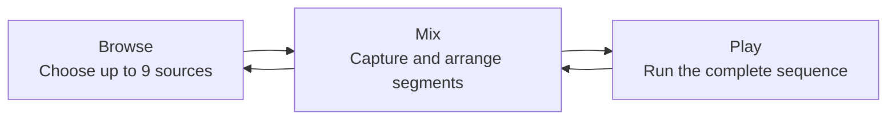

# Music Mixer

Music Mixer is a concept for an approachable browser-based tool that turns up to nine YouTube videos into a playable audiovisual mix.

The experience has three modes:

1. **Browse** — choose a video for each of nine numbered source slots.
2. **Mix** — capture moments from those sources, order them, and overlap them.
3. **Play** — perform the arrangement from beginning to end.

The goal is to feel closer to arranging a mixtape or using a sampler than operating a professional digital audio workstation.

## Concept map



## Core interaction

- Each source is assigned a number key from `1` to `9`.
- A source can be opened to search YouTube or paste a YouTube URL.
- In Mix mode, the user marks a segment's start and end while previewing a source.
- Pressing a source number can capture or trigger a segment, depending on the current state.
- Each video source has a dedicated timeline track where its moments can be reviewed and reordered.
- Play mode follows the arrangement and switches or layers the corresponding video players.

## Documentation

- [Product specification](docs/product-spec.md)
- [Interaction model](docs/interaction-model.md)
- [Source strategy](docs/source-strategy.md)
- [Technical approach](docs/technical-approach.md)
- [First-build brief](docs/first-build.md)
- [Delivery roadmap](docs/roadmap.md)
- [Decisions and open questions](docs/decisions.md)

## Recommended first version

Start with a GitHub Pages-compatible front-end prototype that supports pasted YouTube URLs, nine saved sources, segment start/end editing, dedicated source tracks, and approximate sequenced playback. Add in-app YouTube search after the interaction model and live-player behavior have been tested.

## Development

```sh
npm install
npm run dev
```

`npm run build` creates the static production bundle in `dist/`.

## Status

Phase 0 is underway. The working prototype includes the three-mode shell, nine locally saved YouTube source references, segment creation and validation, dedicated source tracks, live keyboard capture, bounded clip previews with sound, and sequential playback through the official YouTube IFrame Player API.
