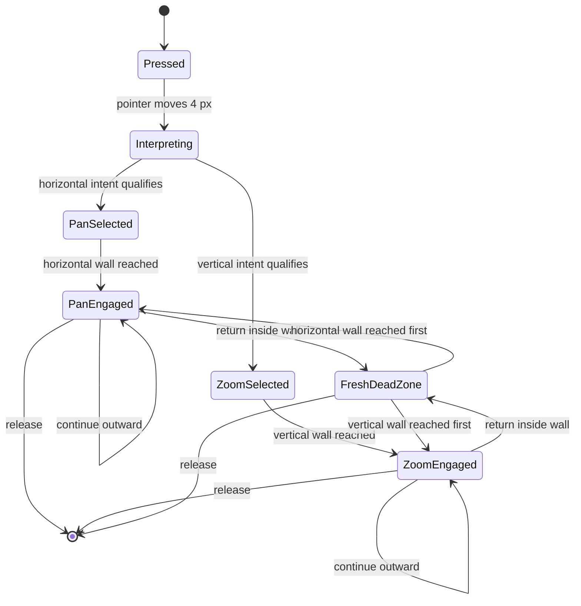
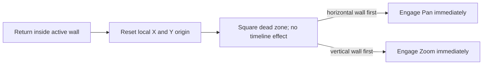

# The Pan and Zoom Gesture Dial

The gesture dial is the visual and behavioral layer that lets one pointer drag control two different timeline operations: horizontal panning and vertical zooming. It is deliberately more expressive than a conventional direction lock. The dial shows when movement is undecided, when an axis has been chosen, when that control is actually affecting the timeline, and when the gesture has returned to a neutral state from which either axis can be chosen again.

The interface has three linked jobs:

1. Interpret a two-dimensional pointer gesture without switching modes accidentally.
2. Show the interpretation continuously through the square, red dot, texture, and changing dial shape.
3. Keep timeline movement, zoom anchoring, playback, and the fixed Head coherent as the interpretation changes.

## The physical metaphor

The overlay begins as a 70 × 70 pixel square containing a red dot. The square is the dead zone. Within it, the dot follows the pointer without moving or scaling the timeline.

Once a primary axis engages, the square behaves like a mechanical dial:

- Horizontal movement selects **Pan** and collapses the square vertically into a horizontal roller.
- Vertical movement selects **Zoom** and collapses the square horizontally into a vertical roller.
- A ridged texture appears only while the control is engaged.
- The activated wall and red dot glow Barbie pink to identify the exact directional boundary in use.
- Texture movement reinforces the direction and distance of travel.
- Texture movement stops at the timeline's zoom and pan limits, even if the pointer continues beyond them.
- Pan limits are the exact scroll positions that place arrangement time zero or the arrangement end beneath the Head; they are not inferred from the browser's raw scroll range.
- Timeline gutters include any measured trailing-space correction needed to make those exact Head-aligned positions physically reachable in the scroll container.
- If an engagement begins while its selected direction is already at a limit, the highlighted surface remains square instead of shrinking into a dial with nothing left to control. A dial that reaches the limit after contracting stays contracted.
- The overlay follows the pointer, so the control remains beside the hand rather than occupying a fixed part of the screen.

The square is not merely decoration. Its walls are control boundaries, its centre is a local coordinate origin, and its changing thickness communicates how strongly the gesture has committed to one axis.

## Gesture states



There is an important distinction between an axis being **selected** and a control being **engaged**. Early motion can establish intent, but the timeline does not respond until the red dot reaches the corresponding wall.

## Initial interpretation

The first few pixels are ignored so an ordinary click does not become a drag. Dragging begins after 4 pixels of pointer travel.

The initial axis interpretation starts after the pointer moves beyond an 18-pixel radius from the press:

- At least 60% vertical intent selects Zoom.
- At most 40% vertical intent selects Pan.
- Ambiguous diagonal movement remains undecided.

Intent is calculated from the absolute horizontal and vertical distances. Selecting an axis does not create a second origin: the original press remains the local centre, so reaching the 30-pixel wall can engage the dial without requiring another full dead-zone traversal.

## Engagement and shrinking

The control engages when primary-axis travel reaches 30 pixels from the current local origin. Engagement is the point where:

- Pan begins scrolling the arrangement;
- Zoom begins changing timeline scale;
- the ridged texture appears; and
- the square begins collapsing perpendicular to the selected axis.

Dial thickness follows this relationship:

```text
inside 30 px                 = 70 px thick
30–85 px primary travel     = contracts from 70 px to 12 px
beyond 85 px                = remains 12 px thick
```

The contraction is intentionally rapid. It turns a neutral two-dimensional pad into an unmistakably one-dimensional control shortly after engagement.

## The red dot has two coordinate systems

The red dot must communicate both pointer fidelity and axis commitment. Its primary-axis and perpendicular positions therefore need separate treatment.

While the dial is square, both coordinates track pointer displacement one-to-one, clamped to the square's walls. While the dial shrinks:

- primary-axis travel continues to represent the active control;
- the allowed perpendicular range contracts with the visible thickness; and
- the dot is progressively pulled toward the dial's centreline.

This prevents the marker from appearing outside the narrowing surface while preserving a small amount of natural two-dimensional hand movement during outward travel.

### Retraction forgets perpendicular movement

When an extended dial begins moving back toward the centre, it immediately discards its remembered perpendicular offset. The dot stays on the centreline throughout the return from a shrunken state.

This rule is intentionally asymmetric:

- Outward travel may retain limited perpendicular expression.
- Inward travel is visually centred and unambiguous.

Retraction must be detected from the unbounded primary-axis travel, not from the rendered dot position. The rendered dot is clamped at 30 pixels and therefore cannot reveal whether a far-extended pointer has started returning.

## Dead-zone re-entry creates a new origin

Returning inside the 30-pixel wall is a full reset, not just a visual expansion.

At the re-entry pointer position the dial:

1. disengages timeline movement;
2. removes the ridged texture;
3. clears the previous Pan or Zoom axis;
4. discards primary and perpendicular offsets;
5. treats the current pointer position as a fresh local origin; and
6. rearms both axes.

From that point, the red dot behaves as though the user had originally pressed there. Whichever wall it reaches next becomes the primary axis. Crossing the horizontal wall engages Pan; crossing the vertical wall engages Zoom. If both walls are crossed in one coarse pointer event, the larger displacement wins. The selected dial starts contracting on that same event, with no extra travel required.



The original press position is still retained for one global visual property: the red dot's opacity fades with total distance from that original press. Local resets alter control geometry without erasing the sense of how far the overall gesture has travelled.

## Pan behavior

An engaged horizontal dial scrolls the timeline by each pointer event's horizontal delta. The active moment remains under the fixed Head, and the arrangement preview follows the Head according to the timeline's normal throttling rules.

During playback, Pan temporarily unlocks the Head relationship so the user can browse the moving arrangement. Entering the dead zone or changing away from engaged Pan stops this temporary playback-pan state and recentres the arrangement on current playback time.

## Zoom behavior

An engaged vertical dial scales the timeline around the arrangement time at the centred Head. Selecting Zoom records both:

- the current timeline zoom; and
- the arrangement timestamp that must remain under the Head.

Zoom is geometric rather than linear because timeline scale is multiplicative. Vertical travel is converted with an exponential curve across the available minimum-to-maximum zoom range:

```text
zoom = origin zoom × exp(log(max zoom / min zoom) × vertical travel / 240)
```

Upward travel zooms in and downward travel zooms out. After every scale update, the stored arrangement timestamp is recentered so changing pixels per second does not move the musical moment away from the Head.

## Visual implementation

The overlay is created only for an active gesture and removed on release. TypeScript supplies state through classes and CSS custom properties:

| Signal | Meaning |
| --- | --- |
| `.panning` | Orient the surface as a horizontal dial |
| `.zooming` | Orient the surface as a vertical dial |
| `.engaged` | Show texture and allow timeline control |
| `.switching` | Indicate proximity to an axis transition |
| `--active-dial-thickness` | Contract the surface from 70 px to 12 px |
| `--dot-x`, `--dot-y` | Position the red marker |
| `--pan-roll`, `--zoom-roll` | Move the ridged texture |
| `--origin-intensity` | Fade the dot with total gesture distance |

The text readout follows the active direction: **Zooming In**, **Zooming Out**, **Earlier**, or **Later**. A re-armed square says **Zoom or Pan** until a wall is selected. At a blocked boundary, the dial turns gray and the readout is replaced by **Limit reached**.

The surface transitions over 40 milliseconds and the red dot over 70 milliseconds. These short transitions soften discrete pointer events without making the control feel delayed. The entire overlay has `pointer-events: none`, so it cannot steal capture from the timeline gesture beneath it.

## Why the state is necessarily detailed

Several values that sound interchangeable are deliberately separate:

- **Original press** controls initial intent and global distance fading.
- **Active dial origin** measures primary-axis travel and is replaced on dead-zone re-entry.
- **Perpendicular origin** measures cross-axis dot motion and resets with the local origin.
- **Last pointer X** calculates incremental pan scrolling.
- **Gesture-origin Y and zoom** anchor the exponential zoom calculation.
- **Previous active travel** detects retraction even when the rendered dot is clamped.
- **Selected mode** says which axis is interpreted.
- **Engaged state** says whether that interpretation is allowed to affect the timeline.

Collapsing these into one origin, one distance, or one mode flag creates subtle failures: delayed engagement after switching, stale perpendicular offsets, jumps on re-entry, accidental timeline movement inside the square, or zoom that drifts away from the Head.

## Behavioral invariants

Future changes should preserve these rules:

- Movement inside the dead zone never changes the timeline.
- Touching a wall engages its control without requiring additional dead-zone travel.
- Re-entry discards the previous axis and establishes a new local origin.
- After re-entry, the next wall—not the original drag direction—chooses the axis.
- A retracting shrunken dial does not remember perpendicular offset.
- The dot remains visually inside the changing dial surface.
- Zoom preserves the arrangement timestamp under the Head.
- Pan and Zoom do not remain active simultaneously.
- Releasing or cancelling the pointer removes the overlay and restores timeline state.

The dial is therefore best understood as a small spatial instrument: neutral in its square state, directional at its walls, increasingly constrained as commitment grows, and fully reconfigurable whenever the hand returns to centre.
