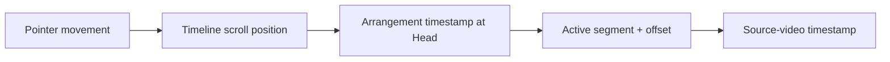
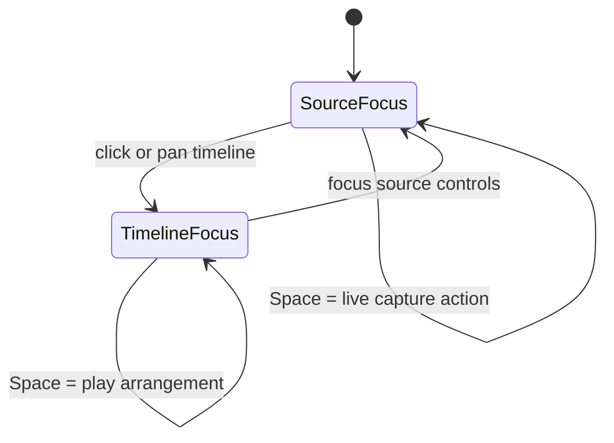
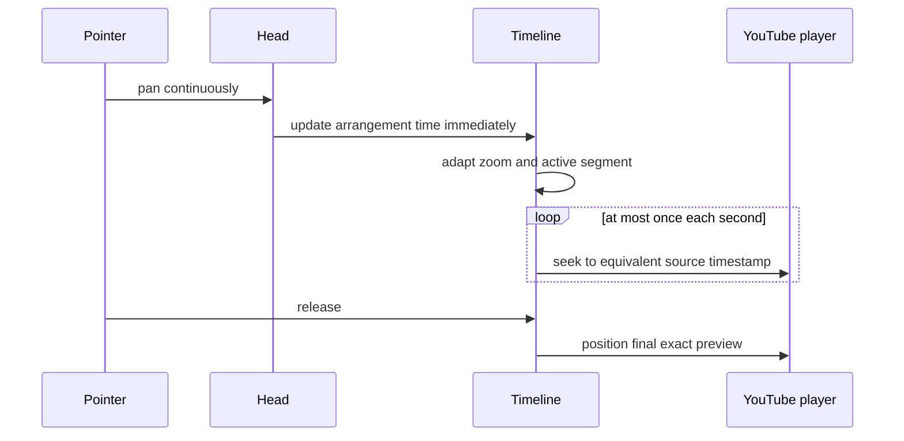

# Panning and the Head

The Head is the fixed vertical marker at the centre of the arrangement timeline. Think of it as a needle over moving tape: the timeline travels beneath it, while the Head answers one question—**what exact arrangement moment am I pointing at?**

## One Head, three coordinate systems

Panning connects three related positions:

Suppose the Head points 7 seconds into an arrangement segment whose source range begins at `01:12`. The equivalent source-video timestamp is `01:19`. The timeline owns the arrangement position; the active segment translates it into source time.

## Ways to move the Head through the arrangement

The Head itself remains visually fixed during ordinary panning. You move the arrangement beneath it.

| Action | Result |
| --- | --- |
| Drag empty timeline space | Pan continuously through arrangement time |
| Drag the only segment in a one-segment timeline | Pan, because there is nothing meaningful to reorder |
| Drag the Head | Scrub the arrangement directly |
| Click the timeline | Move the arrangement position to the clicked point |
| Previous/Next segment buttons | Jump to the adjacent segment boundary |
| `←` / `→` while timeline is focused | Previous/next segment |
| `Space` while timeline is focused | Play or pause from the start of the segment at the Head |

With multiple segments, dragging a segment is reserved for reordering. Pan from the track background, time axis, or another open part of the timeline.

While reordering, holding the dragged segment near the left or right edge continuously pans the arrangement. The segment remains under the pointer and the drop target updates as columns move beneath it. Edge panning uses adaptive scale in **Dynamic pan** mode and preserves the chosen scale in **Fixed Zoom** mode.

## Focus changes the keyboard

The same keys can mean different things depending on where attention lives.

When the timeline has focus, the Previous and Next buttons reveal their `←` and `→` hints. Panning explicitly gives the timeline focus, so the keyboard is ready immediately after a pointer gesture.

In Mix mode, `+` and `−` adjust the timeline zoom from any non-text control. Like the toolbar buttons, either shortcut switches zoom mode to **Fixed Zoom**.

Text inputs remain protected: arrow keys and Space behave normally while typing.

The Mix editor shows a contextual shortcut card beside the video. Focusing a video-side control shows source scrubbing and capture keys; focusing or panning the timeline changes the card to segment navigation, playback, panning, and zoom keys.

## What happens during a pan

Each pointer movement performs a small chain of calculations:

1. Update horizontal scroll from the pointer delta.
2. Convert the centred Head position into arrangement time.
3. Find the segment containing that time.
4. Mark that segment as under the Head.
5. Apply the adaptive zoom curve for the active and neighbouring segments.
6. Re-centre the same arrangement time after the scale changes.
7. Periodically update the YouTube preview.

Step 6 is easy to miss. Changing pixels-per-second would otherwise move the musical moment away from the Head. Re-centring preserves the timestamp while the visual scale changes around it.

## The one-second video-preview rhythm

Seeking an embedded network video on every pointer event would be noisy and expensive. During a pan, the timeline therefore updates visually as quickly as the browser can draw, while the YouTube player follows at most once per second.

If the Head remains within the same video, the player uses `seekTo()` and stays paused. If the Head crosses into a segment from another video, that source is cued before seeking can continue.

## Releasing the pan

An earlier version used YouTube's cue operation on release. Cueing discarded the current decoded frame and replaced it with a thumbnail and large play button.

The current behavior preserves the picture:

1. Seek within the loaded video, or load the required video.
2. Wait until YouTube reports that a real frame is playing.
3. Immediately pause on that frame.

This gives the timeline a useful visual landing state: release the gesture and see the frame that corresponds to the Head.

## Segment states at the Head

Several visual states can overlap. Their intended precedence is:

1. **Currently playing** — orange playback emphasis.
2. **Last added** — green insertion emphasis, even when under the Head.
3. **Under Head** — light neutral selection for the current arrangement position.
4. **Selected** — ordinary editing selection.

The last-added state deliberately overrides the stationary Head colour. A newly recorded moment should remain easy to find even though insertion leaves it under the Head.

## Boundaries and playback

The Head navigates arrangement boundaries, but a boundary does not always require a player operation.

| Boundary | Player behavior |
| --- | --- |
| Same video, contiguous source timestamps | Continue without stop or seek |
| Same video, non-contiguous timestamps | Seek within the existing player |
| Different video | Load the new source |
| End of arrangement | Stop playback |

This distinction is why the Head can cross a visible segment boundary without necessarily producing an audible interruption.

## The useful mental model

If the interaction ever feels complicated, return to this:

> The timeline moves. The Head tells the truth. The video follows at a humane rate.

For the scale calculations that make segments expand and contract around the Head, see [The timeline that breathes](timeline-dynamics.md).
