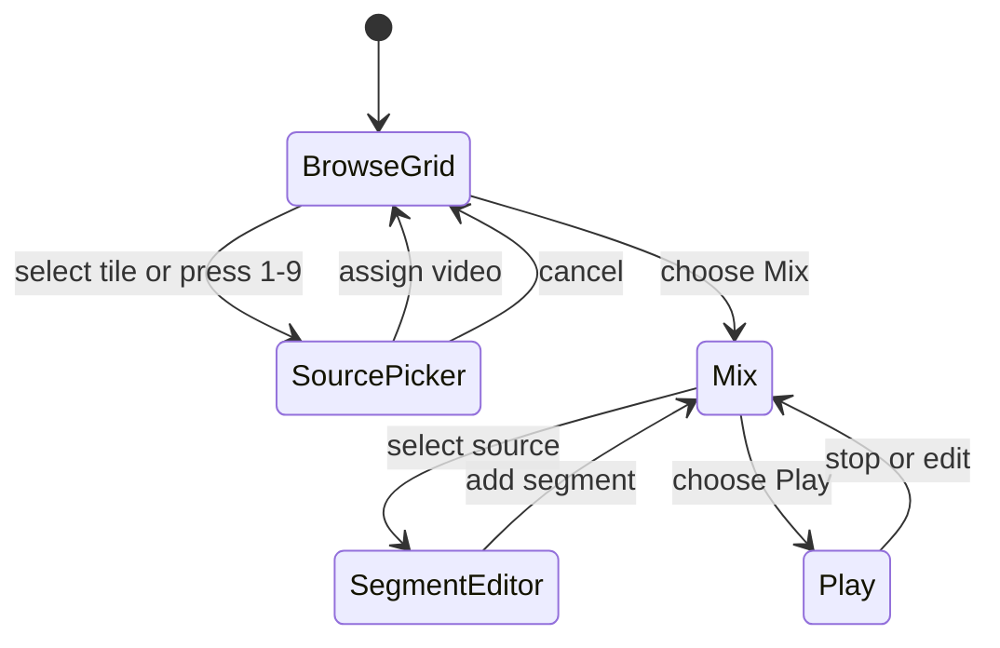

# Interaction model

## Main flow

## Browse: zoom into a source

The transition should preserve spatial context:

1. The selected tile expands into the source picker.
2. The other eight tiles compress into a numbered source dock.
3. Search results appear beside the enlarged preview.
4. Assigning a result updates the tile's thumbnail, title, and duration.
5. Returning to the grid places the tile back in its original position.

This creates the feeling of entering a tile without attempting to embed the full youtube.com browsing interface.

## Mix: make a segment

Recommended click path:

1. Select a source tile.
2. Play or scrub to the desired beginning.
3. Choose **Set start**.
4. Play or scrub to the desired ending.
5. Choose **Set end**.
6. Preview the loop.
7. Choose **Add to mix**.

Recommended keyboard path:

1. Press `1`–`9` to select a source.
2. Press `[` to set the start.
3. Press `]` to set the end.
4. Press `Enter` to add the segment.
5. Press `Space` to preview or pause.

This is clearer than making a number press mean both “choose a source” and “mark time.” A later performance-recording mode can record numbered triggers as timestamped events.

## Arrange: order and overlap

The mix is a timeline of segment instances. Each instance points to one source and stores its own source start, source end, arrangement start, lane, and gain.

```mermaid
gantt
    title Example arrangement
    dateFormat X
    axisFormat %S
    section Main
    Source 1 segment :0, 12
    Source 5 segment :12, 22
    Source 9 segment :22, 34
    section Layer
    Source 4 overlap :8, 17
    Source 6 overlap :19, 28
```

Dragging a segment horizontally changes when it starts. Dragging it vertically changes its lane but not its timing. Dragging either edge trims the source start or end.

## Play: reduce decisions

Play mode shows:

- the primary active video;
- a smaller overlapping or upcoming video;
- the sequence and playhead;
- elapsed and remaining time;
- buffering or unavailable-source warnings; and
- pause and stop.

Editing is intentionally unavailable until the user pauses or returns to Mix mode.

## Empty and error states

- Empty tile: **Add a video** plus its number-key hint.
- Unembeddable video: explain that the uploader has disabled playback and keep the source picker open.
- Removed/private video: mark affected segments and offer to replace the source while preserving timestamps.
- Buffering during playback: pause the arrangement clock or apply the project's chosen recovery policy.
- Keyboard focus in a text field: number keys type normally and do not trigger sources.

