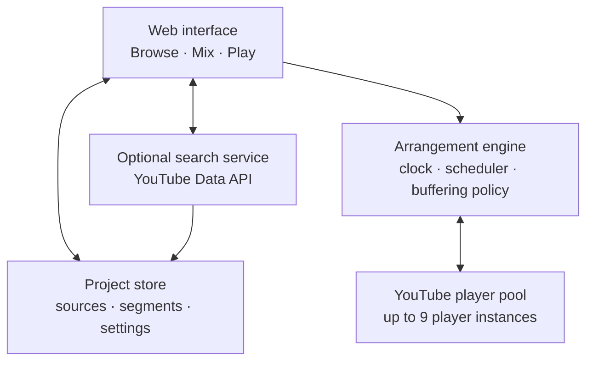

# Technical approach

## Feasibility summary

The concept is feasible as a browser application, with two important constraints:

1. An embedded YouTube player is a controlled video player, not a general-purpose embedded copy of youtube.com. Browse mode therefore needs app-owned search results or pasted URLs.
2. Multiple network video players cannot promise sample-accurate synchronization. The product can create useful overlaps, but it should describe them as approximate and handle buffering explicitly.

## Relevant YouTube capabilities

The [YouTube IFrame Player API](https://developers.google.com/youtube/iframe_api_reference) can load or cue a video by ID, seek, play, pause, read the current time, and accept `startSeconds` and `endSeconds` when a video is loaded with object syntax.

The embedded player search-list feature is deprecated. YouTube recommends retrieving search results with the [YouTube Data API `search.list`](https://developers.google.com/youtube/v3/docs/search/list), then loading the selected video in the player. Searches can be restricted to videos that are embeddable.

The initial prototype can avoid API credentials by accepting pasted YouTube URLs. Search can be added later through a small server-side endpoint so an API key is not exposed in client code.

## Proposed architecture



## Suggested technology

- TypeScript.
- React or another component-based front-end framework.
- YouTube IFrame Player API for playback.
- Browser storage for local projects in the first release.
- A lightweight serverless search endpoint when YouTube search is added.
- A timeline model implemented in application state before adopting a specialized editor library.

The interaction prototype should use deterministic mock media first. This lets the timeline, keyboard controls, and mode transitions be tested without confusing UX defects with network-player limitations.

## Data model

```ts
type Source = {
  id: string;
  slot: 1 | 2 | 3 | 4 | 5 | 6 | 7 | 8 | 9;
  provider: "youtube";
  videoId: string;
  title: string;
  thumbnailUrl: string;
  durationSeconds?: number;
};

type Segment = {
  id: string;
  sourceId: string;
  sourceStartSeconds: number;
  sourceEndSeconds: number;
  arrangementStartSeconds: number;
  lane: number;
  gain: number;
  fadeInSeconds?: number;
  fadeOutSeconds?: number;
};

type MixProject = {
  version: 1;
  title: string;
  sources: Source[];
  segments: Segment[];
};
```

## Playback scheduler

The arrangement engine should use one monotonic master clock. On each scheduling window it determines which segments should be active, cues their players shortly before their arrangement start, seeks to the required source time, and starts or stops them at the closest practical moment.

Suggested recovery policy for the first live version:

- Preload the next one or two players.
- Start only after all sources required in the opening window are ready.
- If a primary player buffers, pause the arrangement clock and all active players.
- If a secondary overlap buffers, continue the primary player and show that the layer was skipped.
- Record timing telemetry during development to measure drift rather than assuming synchronization quality.

## Browser and policy considerations

- Browsers may block autoplay with sound until the user has interacted with the page.
- Some videos cannot be embedded or may later become private or unavailable.
- The application should use official players and APIs and must not download, extract, or rehost media.
- API credentials must not be committed to the repository or shipped directly in browser code.
- Player instances need enough space when visible to satisfy YouTube's embedded-player requirements; inactive players can be managed separately from the visible tile presentation.

## Testing strategy

1. Unit-test timeline calculations and overlap selection.
2. Test keyboard behavior with and without focused text fields.
3. Test project serialization and migration.
4. Simulate delayed, failed, and unavailable players.
5. Measure real playback drift across browsers and network conditions.
6. Run usability sessions with people who have never used audio-editing software.

