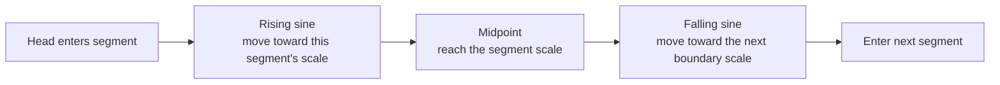
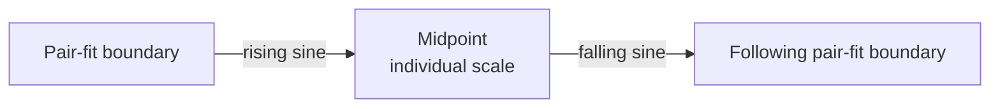
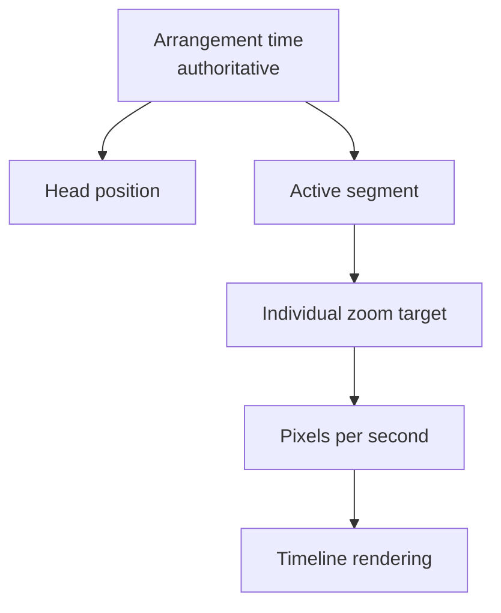

# The timeline that breathes

Most timelines make a simple promise: one second always occupies the same number of pixels. Music Mixer deliberately bends that rule while you explore an arrangement.

A two-second accent and a two-minute passage should both be legible. If the scale never changes, the accent becomes a sliver or the long passage disappears beyond the window. The adaptive timeline treats scale more like a camera lens: it moves closer for small moments and pulls back for long ones.

## The central idea

Every segment follows a sine-shaped zoom curve. It starts at the incoming pair-fit boundary scale, reaches the segment's individual scale at the midpoint, and returns toward the outgoing pair-fit boundary scale. Segment boundaries therefore remain pair-aware without introducing a central plateau.



The result is continuous rather than a sequence of jumps. Scale changes across the whole segment, with the sine peak providing a gentle turn at the midpoint.

## What “one fifth” means

The target is calculated from the visible track area, excluding the fixed track-label column:

```text
target segment width = visible track width / 5
target zoom          = target segment width / segment duration
adjacent pair limit  = visible track width / 2
close-up zoom limit  = 50 px/s (2 seconds per 100 pixels)
```

At a boundary, the two touching segments, including their gap and minimum column widths, cannot exceed one half of the usable track. The boundary target is the lower of that pair-fit limit and the geometric midpoint of the segments' individual targets. The calculation is also capped at 50 pixels per second, preserving the close-up bound of two seconds per 100 pixels. Because pair fitting applies at the boundary rather than changing either segment's individual target, a distant neighbour cannot leak into the transition on the other side of a short segment.

For example, if the usable track is 1,000 pixels wide, the target segment width is about 200 pixels:

| Segment duration | Individual target |
| ---: | ---: |
| 2 seconds | 100 px/s |
| 10 seconds | 20 px/s |
| 40 seconds | 5 px/s |

There is a close-up limit of **2 seconds per 100 pixels**, or 50 pixels per second. A very short segment therefore stops enlarging once it reaches that scale. This keeps tiny moments useful without letting them take over the screen.

## Moving between different-sized moments

The zoom values are interpolated geometrically. This matters because zoom is multiplicative: moving from `5 px/s` to `50 px/s` should feel like a change in scale, not a linear slide through arbitrary numbers.

The curve has two parts:

1. **Boundary to midpoint.** The rising half of `sin(π × progress)` approaches the active segment's individual target.
2. **Midpoint to boundary.** The falling half of the sine moves from the individual target toward the following pair-fit scale.

Every scale change uses the same sine curve across the segment. Geometric interpolation already reflects the size of the difference, so the curve does not add extra acceleration for high-contrast pairs. The midpoint remains owned by its segment, while each boundary is owned only by the pair that touches it. Adaptive pair fitting may move below the manual fit-to-screen minimum when necessary to honor the half-screen limit. The curve is tied to the Head position so panning backward retraces the same scale change.



The timeline updates in place while panning. Segment columns, time labels, group outlines, zoom controls, and the Head position all receive the same new scale. Re-rendering the entire workspace during a drag would interrupt the pointer interaction, so the live scale change is intentionally surgical.

Dynamic pan zoom is enabled by default. The arrangement toolbar toggles between two locally stored modes:

- **Dynamic pan:** apply the adaptive sine scale at the Head.
- **Fixed Zoom:** preserve the selected scale while panning horizontally, or drag vertically to adjust zoom geometrically between the whole timeline's minimum and maximum scales. The fixed zoom-out limit allows twice the fit-to-screen seconds per pixel, so the complete arrangement can contract to roughly half of the usable track width.

Pressing either minus or plus always switches to **Fixed Zoom** before applying the requested zoom. Switching dynamic zoom back on immediately applies the adaptive scale at the Head.

When frame buffering is disabled, timeline preview positioning always uses YouTube's non-priming cue path, even if that video has already rendered or played. Previously rendered state does not override the setting.

## A different rule while recording

Live insertion has a special geometry. The new bar ends at the fixed Head and grows to the left. It therefore has only the left half of the timeline in which to remain visible.

While recording, the zoom progressively scales out using the actual space between the track-label edge and the Head. This is different from sine-curve navigation:

- **Recording:** keep the growing tail visible to the left of the Head.
- **Exploring:** make each segment roughly one fifth of the track at the peak of its sine curve.

Once recording ends, the saved segment participates in the ordinary boundary-to-midpoint sine zoom system.

## Scale is visual; time remains authoritative

Adaptive zoom never changes a segment's timestamps or duration. Arrangement time remains the source of truth. The zoom only changes the mapping between time and pixels.



This separation is important: a segment may appear wider or narrower as the Head moves, but its musical length never changes.

## Playback continuity behind the picture

The visible timeline and YouTube player cooperate, but they solve different problems.

- Contiguous segments from the same video play as one uninterrupted run. Internal boundaries update the interface without stopping or seeking the player.
- Non-contiguous segments from the same video reuse the loaded player and seek to the next source timestamp.
- A change of video loads the required source.
- Segment end bounds are avoided where they would stop the player immediately before an internal same-video transition.

This reduces artificial pauses, although a non-contiguous YouTube seek can still wait for a keyframe or unbuffered media.

## Design character

The adaptive timeline is not trying to be a ruler. It is trying to be a readable map.

The invariant is not “every second is always the same width.” The invariant is “the Head always represents the correct arrangement time.” Everything around that invariant may breathe to keep the structure understandable.

See [Panning and the Head](head-and-panning.md) for the hands-on interaction model.
