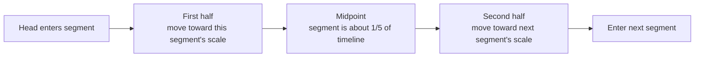
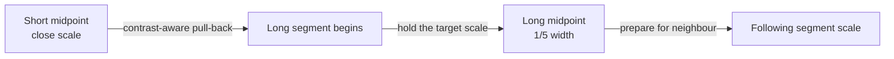
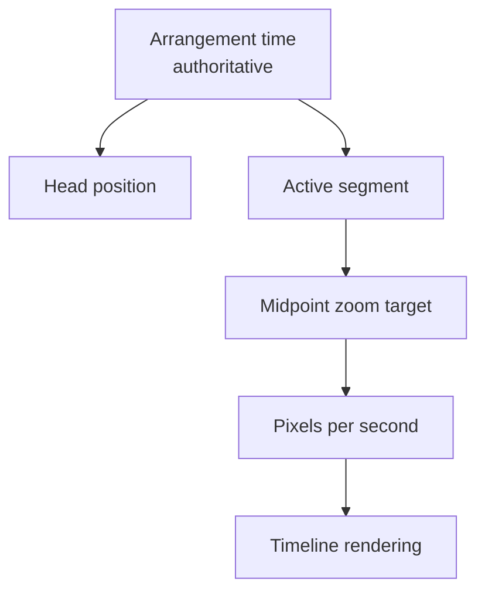

# The timeline that breathes

Most timelines make a simple promise: one second always occupies the same number of pixels. Music Mixer deliberately bends that rule while you explore an arrangement.

A two-second accent and a two-minute passage should both be legible. If the scale never changes, the accent becomes a sliver or the long passage disappears beyond the window. The adaptive timeline treats scale more like a camera lens: it moves closer for small moments and pulls back for long ones.

## The central idea

Every segment has a zoom anchor at its midpoint. At that anchor, the segment aims to occupy roughly one fifth of the visible timeline width.



The result is continuous rather than a sequence of jumps. The midpoint of each segment is a visual anchor, and the space between anchors is a transition.

## What “one fifth” means

The target is calculated from the visible track area, excluding the fixed track-label column:

```text
target segment width = visible track width / 5
target zoom          = target segment width / segment duration
```

For example, if the usable track is 1,000 pixels wide, the target segment width is about 200 pixels:

| Segment duration | Midpoint target |
| ---: | ---: |
| 2 seconds | 100 px/s |
| 10 seconds | 20 px/s |
| 40 seconds | 5 px/s |

There is a close-up limit of **2 seconds per 100 pixels**, or 50 pixels per second. A very short segment therefore stops enlarging once it reaches that scale. This keeps tiny moments useful without letting them take over the screen.

## Moving between different-sized moments

The zoom values are interpolated geometrically. This matters because zoom is multiplicative: moving from `5 px/s` to `50 px/s` should feel like a change in scale, not a linear slide through arbitrary numbers.

The curve has two parts:

1. **Previous midpoint to current midpoint.** The timeline moves from the previous segment's target scale toward the active segment's one-fifth target.
2. **Current midpoint to next midpoint.** The timeline leaves the active target and approaches the following segment's target across both adjacent half-segments.

A severe short-to-long change gets a moderately stronger response as the Head moves between the two scales. The transition spans the full distance between segment midpoints instead of being squeezed into half of the short segment. A smootherstep envelope keeps the beginning and end gradual, even when the durations differ sharply. Target scales are clamped to the timeline's current minimum and maximum zoom, and the curve is tied to the Head position so panning backward retraces the same scale change.



The timeline updates in place while panning. Segment columns, time labels, group outlines, zoom controls, and the Head position all receive the same new scale. Re-rendering the entire workspace during a drag would interrupt the pointer interaction, so the live scale change is intentionally surgical.

## A different rule while recording

Live insertion has a special geometry. The new bar ends at the fixed Head and grows to the left. It therefore has only the left half of the timeline in which to remain visible.

While recording, the zoom progressively scales out using the actual space between the track-label edge and the Head. This is different from midpoint navigation:

- **Recording:** keep the growing tail visible to the left of the Head.
- **Exploring:** make each segment roughly one fifth of the track at its midpoint.

Once recording ends, the saved segment participates in the ordinary midpoint-to-midpoint zoom system.

## Scale is visual; time remains authoritative

Adaptive zoom never changes a segment's timestamps or duration. Arrangement time remains the source of truth. The zoom only changes the mapping between time and pixels.



This separation is important: a segment may appear wider or narrower as the Head moves, but its musical length never changes.

## Playback continuity behind the picture

The visible timeline and YouTube player cooperate, but they solve different problems.

- Contiguous segments from the same video play as one uninterrupted run. Internal boundaries update the interface without stopping or seeking the player.
- Non-contiguous segments from the same video reuse the loaded player and seek to the next source timestamp.
- A change of video loads the required source.
- Segment end bounds are avoided where they would stop the player immediately before an internal same-video transition.

This reduces artificial pauses, although a non-contiguous YouTube seek can still wait for a keyframe or unbuffered media.

## Design character

The adaptive timeline is not trying to be a ruler. It is trying to be a readable map.

The invariant is not “every second is always the same width.” The invariant is “the Head always represents the correct arrangement time.” Everything around that invariant may breathe to keep the structure understandable.

See [Panning and the Head](head-and-panning.md) for the hands-on interaction model.
